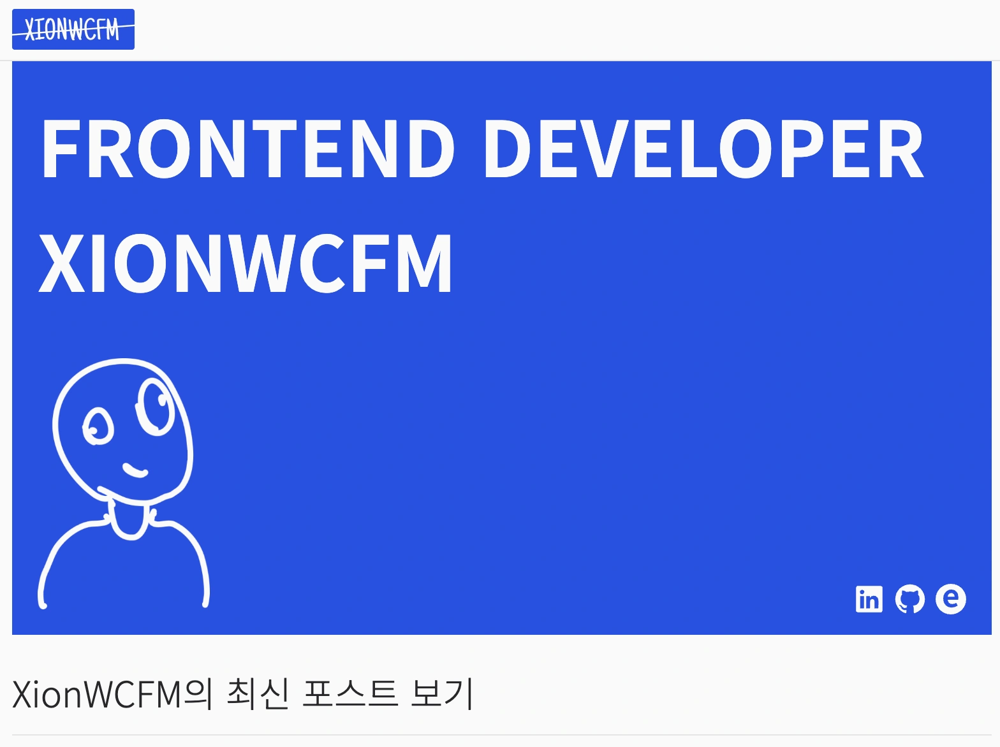
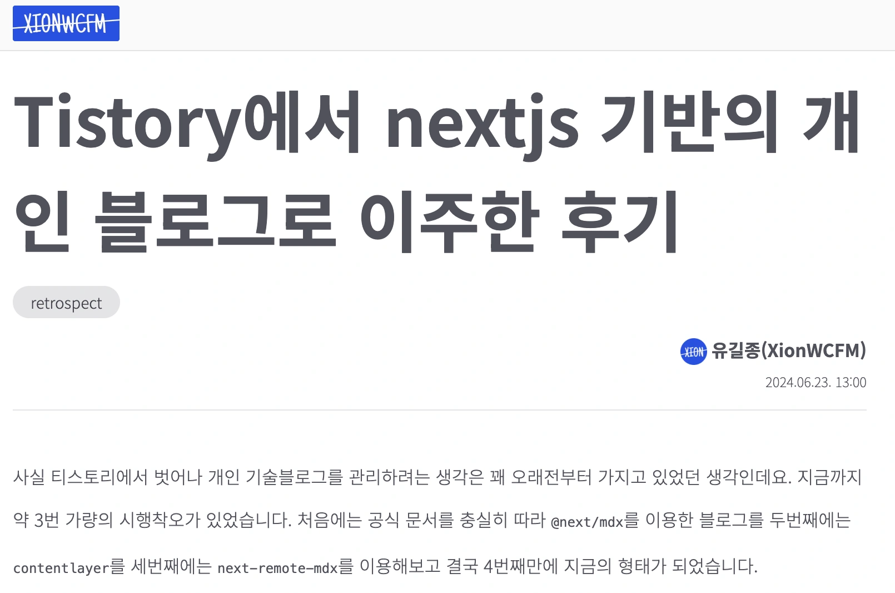

# xionwcfm monorepo

Turbo Repo와 Pnpm Workspace로 구성된 모노레포 프로젝트입니다.

[xionwcfm-lib Repository](https://github.com/XionWCFM/xionwcfm-lib)에 의존성을 갖습니다.

```
git clone https://github.com/XionWCFM/xionwcfmrepo.git
pnpm i
pnpm run build:p
```

`apps`의 프로젝트는 `packages`의 빌드산출물에 의존하기때문에 처음 프로젝트를 clone 받았다면 패키지를 빌드해야합니다.

```
pnpm run build:p
```

명령어를 통해 packages 폴더 전체를 빌드하세요


## Project

### **[xionwcfm blog project](https://www.xionwcfm.com/)**

next.js app router와 next-mdx-remotes를 기반으로 구성된 블로그 프로젝트입니다.


#### Link

**[이 블로그에 방문해보세요!](https://www.xionwcfm.com/)**

**[이 블로그의 초기 디자인 기획 및 구현 과정을 확인해보세요](https://www.xionwcfm.com/posts/retrospect/blog-migration)**

**[mdx 작성 시의 개발자 경험을 개선하기 위한 MDX 파일 자동 Refresh 기능 구현 과정](https://xionwcfm.tistory.com/457)**

<div style="display: flex; justify-content: space-between;">
  
  
</div>


# CONVENTION

## LABEL CONVENTION

라벨은 아래 PR 컨벤션에서도 동일하게 사용될 수 있습니다.

- chore : 아래 라벨에 포함되지 않는 지루한 작업을 수행한 경우 사용합니다.

- documentation : 문서를 업데이트한 경우 사용합니다.

- feature : 새로운 기능을 구현했을 때 사용합니다.

- bug : 버그 수정시 사용합니다.

- hotfix : 급한 수정사항이 있을 경우 사용합니다.

- refactoring : 코드의 동작을 변경하지 않고 구조를 개선한 경우 사용합니다.

- progress : 해당 PR로 완결되지 못하는 커다란 작업을 수행하고 있을 때 사용합니다.


## PR CONVENTION

모든 PR의 제목은 다음과 같은 명명규칙을 준수합니다.

[yyyy.MM.dd] Label: 작업 내용

### example

[2024.06.19] feature: CI/CD 구성 설정 적용 및 workspace 설정 추가

---

## COMMIT CONVENTION

gitmoji를 이용하여 emoji를 통해 작업내용을 나타내며 각 Commit의 제목은 작업 내용을 나타냅니다.


---

## insight

[모노레포에서 Internal Packages를 관리하는 3가지 방법](https://xionwcfm.tistory.com/464)

.
